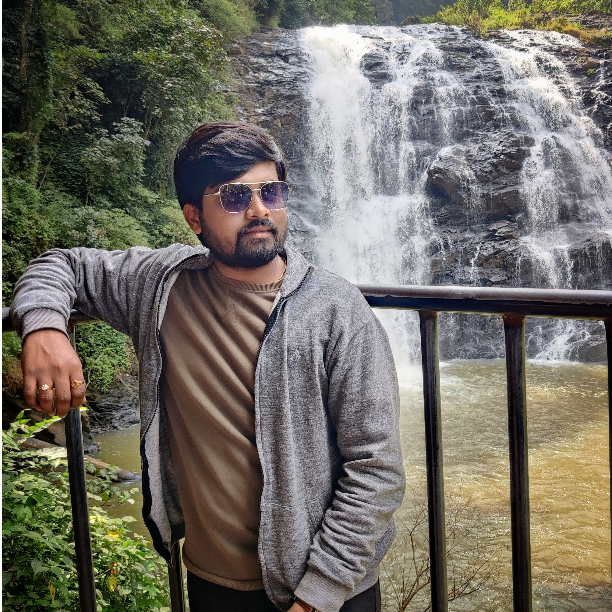

# Sai Krishna Reddy Seelam

Here are some intrests and facts about me

I am passonate to become a professional Software Engineer in my carrier. A part from professional life I really like to enjoy my leisure time playing sports such as Badminton and Volleyball which really cherish my body and mind.  
As Mentioned regarding professionalism I would like to do coding rather other technicalites. Because it's really challenging while doing enhancemets based on client requirements.

---

## Maintain Fitnees, Improve health, and Do team work

If you're aiming to stay fit and healthy , enhance the day to day life plan and build good teamwork, Try adding these sports to your weekly routine:

| Sport           | Reason to Recommend                                   | Weekly Hours |
| --------------- | ----------------------------------------------------- | ------------ |
| Volleyball      | Great for improving coordination and team dynamics.  | 6-7 hours    |
| BaskectBall          | Excellent for cardiovascular health and team dynamics.      | 3-5 hours    |
| Batminten          | Perfect for exploring nature and staying fit.         | 6-8 hours    |
| Swimming        | Low-impact exercise that engages the whole body.      | 2-5 hours    |

---
## Pithy Quotes by Scientists

> Dream, dream, dream. Dreams transform into thoughts and thoughts result in action.
> -  *Dr. A.P.J. Abdul Kalam*

> I didn't fail 1,000 times. The light bulb was an invention with 1,000 steps.
> - *Thomas Alva Edison*
